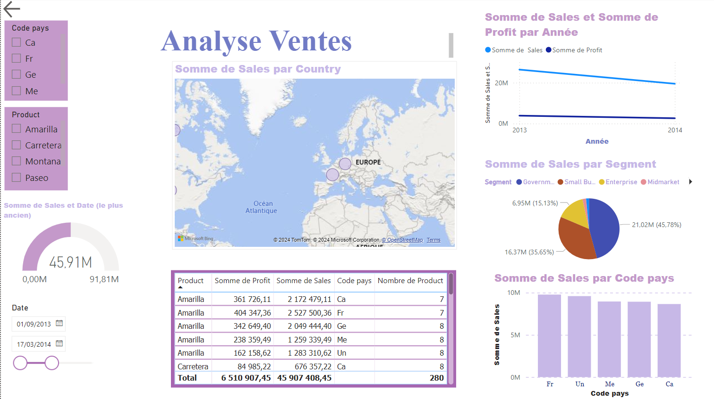

# Sales Report Dashboard in Power BI 🚀

## Project Overview
This project is a **Sales Report Dashboard** built in Power BI to analyze and visualize key sales performance metrics. It offers in-depth insights into sales trends, product performance, profitability, and customer segmentation to support data-driven decision-making. By using dynamic visuals and filters, this dashboard provides stakeholders with clear, actionable insights into various aspects of sales data.

## Key Features

### 1. Sales Trend Analysis
   - A clear overview of monthly and yearly sales performance is provided, allowing users to easily spot key peaks and declines in sales.

### 2. Top-Selling Products
   - A detailed breakdown of the best-selling products with their contributions to total revenue. Users can see which products drive the most revenue.

### 3. Customer Segmentation
   - Customer segments are analyzed to understand demographics and purchasing patterns. This feature identifies high-value segments and potential opportunities for targeted campaigns.

### 4. Profitability Insights
   - Visualization of product profitability helps identify high-margin products and areas where costs might be optimized.

### 5. Sales by Region
   - A geographical analysis of sales performance identifies the most profitable regions and reveals market expansion opportunities.

### 6. KPIs
   - Key metrics, such as **Total Revenue**, **Average Order Value**, and **Customer Lifetime Value (CLV)**, are displayed prominently to support quick and informed decision-making.

## Dashboard Components

1. **Sales Overview by Country**:
   - A **map visualization** highlights the distribution of sales across various countries, with regions marked to show sales concentration.

2. **Annual Sales and Profit Trends**:
   - A **line chart** compares the **Sum of Sales** and **Sum of Profit** between 2013 and 2014, providing an easy-to-read trend analysis over time.

3. **Product Category Breakdown**:
   - Users can filter product categories (e.g., "Amarilla," "Carretera," "Montana," "Paseo") to examine each product’s contribution to overall sales and profitability.

4. **Sales by Customer Segment**:
   - A **pie chart** displays sales breakdown by customer segment, showing contributions from **Government, Small Business, Enterprise,** and **Midmarket** customers.

5. **Sales by Country Code**:
   - A **bar chart** illustrates sales by country codes, allowing for quick comparisons among selected countries.

6. **KPI Indicators**:
   - A **gauge** displays the total sales amount in millions, visualizing actual sales performance against a target.
   - A **date range slider** allows users to filter sales data by specific dates, enabling more detailed time-based analysis.

7. **Profit and Product Details Table**:
   - A **detailed table** at the bottom presents sales and profit data broken down by **Product, Sales, Profit, Country Code,** and **Product Count** for a granular view of product-level and regional performance.

## Technologies Used

- **Power BI**: Created interactive and visually compelling dashboards with slicers and drill-down capabilities.
- **DAX (Data Analysis Expressions)**: Implemented complex calculations for accurate KPI tracking and profitability analysis.
- **SQL**: Utilized to extract, clean, and prepare data from multiple sources before feeding it into the dashboard.
- **Data Visualization**: Leveraged advanced visualization techniques to create clear, actionable insights for stakeholders.

## Getting Started

To view and interact with the Power BI dashboard, follow these steps:

1. **Download Power BI Desktop** if not already installed.
2. **Clone this repository** to your local machine.
3. **Open the Power BI file (.pbix)** to explore the dashboard, interact with visuals, and analyze the sales data.

## Usage Tips

- Use the **filters** on the left (by country code and product) to customize the view according to your analysis needs.
- Utilize the **date range slider** to see sales data for specific time periods.
- Hover over chart elements for **

